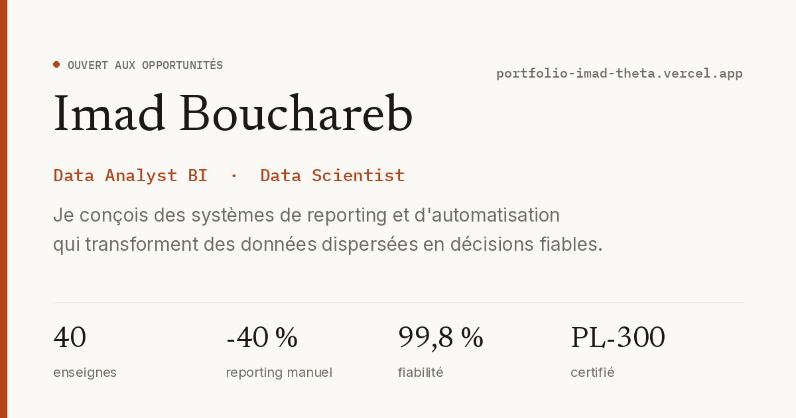

# Portfolio — Imad Bouchareb

Portfolio personnel présentant mon parcours et mes projets en Data Analysis, Business Intelligence et Data Science.

**Démo : [portfolio-imad-theta.vercel.app](https://portfolio-imad-theta.vercel.app)**



## Stack

- **React** — interface en composants
- **Vite** — build et dev server
- **Tailwind CSS** — styling
- **Vercel** — déploiement continu depuis `main`

## Fonctionnalités

- Interface bilingue français / anglais
- Sections : à propos, expériences, projets, contact
- CV téléchargeable en PDF
- Design responsive

## Lancer en local

```bash
git clone https://github.com/Imadbouchareb/portfolio-imad.git
cd portfolio-imad
npm install
npm run dev
```

Le site est alors disponible sur `http://localhost:5173`.

## Build de production

```bash
npm run build
npm run preview
```

## Structure du projet

```
portfolio-imad/
├── public/          # Assets statiques (images, CV PDF)
├── src/             # Composants React et styles
├── index.html
├── tailwind.config.js
└── vite.config.js
```

## Contact

[LinkedIn](https://linkedin.com/in/imadbouchareb/) · [GitHub](https://github.com/Imadbouchareb) · imad.bouchareb08@gmail.com
